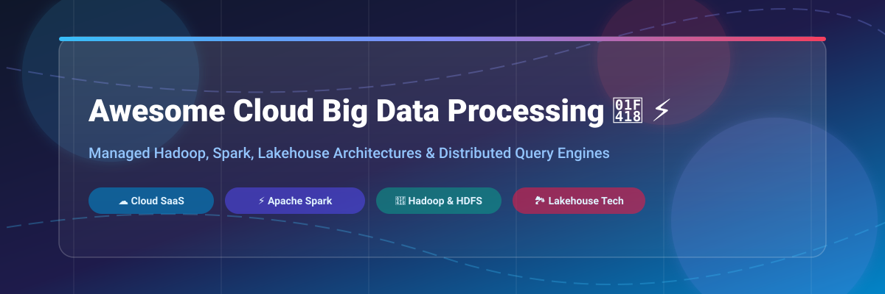

# Awesome-Cloud-Big-Data-Processing-Hadoop-Spark 🐘 ⚡

  

  
  
  
  
  
  

---

## 🌟 Top Cloud Big Data Processing (Hadoop / Spark) Ecosystem 📊

**Curated List of Commercial Big Data Platforms & Open-Source Processing Frameworks**  
*Focused on Managed Spark/Hadoop Services, Lakehouse Architectures, Query Engines, Batch & Stream Processing* 🚀

**Last updated: October 2026** 📅

---

### 📌 Overview & SEO Summary 🔍

Welcome to the ultimate curated directory of **cloud big data processing platforms**, **open-source Spark and Hadoop distributions**, and **managed lakehouse services**. Whether you are looking for enterprise-grade commercial solutions (such as *Amazon EMR*, *Databricks*, and *Google Cloud Dataproc*), or self-hostable open-source alternatives (like *Apache Spark*, *Apache Hadoop*, and *Trino*), this list covers category leaders, serverless processing engines, and privacy-respecting data architectures.

---

## 📑 Table of Contents 📜

- [🏢 SaaS & Commercial Platforms](#-saas--commercial-platforms)
- [🔓 Open-Source GitHub Projects](#-open-source-github-projects)
- [🛠️ How to Contribute](#%EF%B8%8F-how-to-contribute)
- [📊 Star History](#-star-history)
- [🤝 Support & Sponsorship](#-support--sponsorship)
- [⚠️ Disclaimer](#%EF%B8%8F-disclaimer)

---

## 🏢 SaaS / Commercial Platforms ☁️

> **Market Insights & Industry Dynamics:**  
> The global cloud big data and analytics processing market size is estimated at **~$120 Billion - $150 Billion**, exhibiting rapid consolidation around major cloud hyper-scalers (AWS, GCP, Azure) and leading lakehouse platforms (Databricks, Snowflake). The sector is **moderately fragmented** — while cloud infrastructure hyper-scalers control core managed compute primitives, specialized lakehouse, streaming, and query engine vendors command high-margin enterprise workloads.

The cloud big data processing market spans **managed Spark/Hadoop services** that charge per-instance plus a platform uplift, and **lakehouse platforms** that meter in proprietary units (DBUs, CCUs, DCUs). **Amazon EMR** bills the underlying EC2 rate plus an **EMR uplift (~27%) on master and core nodes**; task nodes bill EC2 only with no uplift, making Spot task nodes a key optimization . EMR Serverless bills **$0.052624 per vCPU-hour and $0.0057785 per GB-hour** in us-east-1 . **Google Cloud Dataproc** charges only a **small management fee ($0.01/vCPU/hour)** on top of GCE VM pricing, making it cost-effective for pure Spark batch workloads . **Azure HDInsight** bills per node-hour with **no core-hour charge** for Hadoop/Spark, but Enterprise Security Package adds **¥0.06 per core-hour** . **Databricks** meters in **DBUs**: SQL Serverless at **$0.70/DBU** (instance cost included), SQL Pro at **$0.55/DBU**, and SQL Classic at **$0.22/DBU** . **Cloudera** meters in **CCUs** with published list prices: Data Engineering Core at **$0.07/CCU**, Data Warehouse at **$0.20/CCU**, Machine Learning at **$0.20/CCU**, and Data Hub at **$0.04/CCU** — control-plane API calls are not billed, but the resources they create are .

| SaaS / Commercial Platform | Company / Owner | Company Size (Valuation / Market Cap) | Standard Edition Starting Price | Free Tier / Free Trial Limits | Description |
| :--- | :--- | :--- | :--- | :--- | :--- |
| **[Azure HDInsight](https://azure.microsoft.com/en-us/products/hdinsight/)** 🔷 | Microsoft | ~$3.90 Trillion | **Base price/node-hour + ¥0/core-hour** for Hadoop/Spark | **30-day free trial** with $200 Azure credits | **Azure-native managed Hadoop/Spark** — Enterprise Security Package: +¥0.06/core-hour . Supports Kafka, HBase, Storm, and Interactive Query. |
| **[Amazon EMR](https://aws.amazon.com/emr/)** ☁️ | Amazon | ~$2.0 Trillion | **EC2 rate + ~27% EMR uplift on master/core nodes** ($0.052624/vCPU-hr EMR Serverless) | **750 hours of m1.small or m3.medium for 12 months** (new AWS accounts) | **AWS-native big data processing** — Managed Hadoop, Spark, Hive, Presto, and HBase clusters. EMR Serverless: $0.052624/vCPU-hr + $0.0057785/GB-hr. |
| **[Google Cloud Dataproc](https://cloud.google.com/dataproc)** 🌐 | Google (Alphabet) | ~$2.0 Trillion | **$0.01/vCPU-hour management fee** + GCE VM pricing | **90-day free trial** with $300 GCP credits | **GCP-native managed Spark/Hadoop** — Simplest pricing in market: no DBU overhead, per-second billing. Integrates with BigQuery and GCS. |
| **[Snowflake](https://www.snowflake.com/)** ❄️ | Snowflake | ~$50 Billion | **$2.00/credit** (Standard Edition) | **30-day free trial** with $400 credits | **Cloud data warehouse & lakehouse** — Multi-cluster shared data architecture with per-second credit billing. |
| **[Databricks Lakehouse](https://www.databricks.com/)** 🧱 | Databricks | ~$43 Billion | **$0.22/DBU** (SQL Classic); $0.55/DBU (SQL Pro); $0.70/DBU (SQL Serverless) | **14-day free trial** for pay-as-you-go plans | **Unified analytics and AI platform** — Delta Lake, MLflow, and Unity Catalog. Serverless SQL warehouses scale elastically. |
| **[Dremio Cloud](https://www.dremio.com/)** 🦅 | Dremio | ~$2.0 Billion | **$0.20/DCU** (Dremio Compute Unit) | **Free forever plan** (up to 5 DCUs) + $400 trial credits | **Managed lakehouse engine on AWS/Azure** — Elastic Engines scale to zero, Autonomous Reflections, and Apache Iceberg catalog. |
| **[Starburst Galaxy](https://www.starburst.io/)** ⭐ | Starburst | ~$1.2 Billion | **$0.50/credit** (Pro Edition) | **Free forever: up to 3 clusters** + 30-day trial with $500 compute credits | **Managed Trino lakehouse platform** — Credits are a universal compute unit; free tier supports standard execution mode. |
| **[Cloudera Data Platform (CDP)](https://www.cloudera.com/)** 🏢 | Cloudera | ~$5.3 Billion | **$0.04/CCU-hour** (Data Hub); $0.07/CCU-hour (Data Engineering Core) | **60-day free trial** (lead-capture gated) | **Enterprise data platform** — CDP meters in Cloudera Compute Units (CCUs). Hybrid multi-cloud data governance and management. |
| **[Qubole](https://www.qubole.com/)** 🔥 | Qubole (Idera) | ~$1.0 Billion | **$0.17/QCU-hour** (usage-based) | **Business Edition free: 30,000 QCPU/month** on Oracle Cloud (BYOC) | **Cloud data platform** — Managed Spark, Hive, Presto, and TensorFlow engines with auto-scaling compute. |
| **[Ahana Cloud](https://www.ahana.io/)** ☁️ | Ahana (Acquired by IBM) | Private / Acquired | **Enterprise, starting $0.40/hour/node** | **14-day free trial** on AWS | **Managed Presto/Trino on AWS** — Ahana Cloud provides a fully managed, turn-key query engine for data lakes. |

---

## 🔓 Open-Source GitHub Projects 🔓

*Sorted by GitHub Stars Count (Descending)* 🌟

- **[Apache Spark](https://github.com/apache/spark)**  ⚡  
  **Unified analytics engine for large-scale data processing**, Apache-2.0 licensed. Batch processing, streaming, SQL, ML, and graph processing. Runs on Kubernetes, YARN, and standalone clusters. **The foundational processing engine for the entire ecosystem** — Amazon EMR, Databricks, Dataproc, and HDInsight all run Spark under the hood .

- **[Apache Airflow](https://github.com/apache/airflow)**  🌊  
  **Workflow orchestration platform**, Apache-2.0 licensed. DAG-based pipeline scheduling with operators for EMR, Dataproc, and Databricks. **The monitoring and orchestration layer for DataOps** .

- **[Apache Flink](https://github.com/apache/flink)**  🌊  
  **Stateful stream processing framework**, Apache-2.0 licensed. True stream processing with event-time semantics and exactly-once guarantees. **The streaming counterpart to Spark** — used where sub-second latency matters.

- **[Presto](https://github.com/prestodb/presto)**  🔷  
  **Distributed SQL query engine for big data**, Apache-2.0 licensed. The original Presto project created by Facebook. **Ahana Cloud was built on Presto** .

- **[Apache Hadoop](https://github.com/apache/hadoop)**  🐘  
  **Distributed storage and processing framework**, Apache-2.0 licensed. HDFS for storage, MapReduce for batch processing, YARN for resource management. **The original big data platform** — still the foundation for HDFS-based architectures .

- **[Trino](https://github.com/trinodb/trino)**  🔍  
  **Fast distributed SQL query engine**, Apache-2.0 licensed. Queries data where it lives — HDFS, S3, Kafka, RDBMS, and more. **The open-source engine behind Starburst** . PrestoSQL successor with active community development.

- **[dbt Core](https://github.com/dbt-labs/dbt-core)**  🔧  
  **Analytics engineering transformation tool**, Apache-2.0 licensed. SQL-based transformations with version control, testing, and documentation. **The transformation layer in modern data stacks** alongside Spark and Airflow .

- **[Delta Lake](https://github.com/delta-io/delta)**  🏞️  
  **Storage framework for lakehouse architecture**, Apache-2.0 licensed. ACID transactions, scalable metadata handling, and unified batch/streaming. **The open-source foundation of Databricks** — brings reliability to data lakes on S3, HDFS, and Azure Blob .

- **[Apache Iceberg](https://github.com/apache/iceberg)**  ❄️  
  **Open table format for huge analytic datasets**, Apache-2.0 licensed. Schema evolution, hidden partitioning, and time travel. **The table format used by Snowflake, Dremio, and Starburst** for open lakehouse architectures.

- **[Apache Hive](https://github.com/apache/hive)**  🐝  
  **Data warehouse software for Hadoop**, Apache-2.0 licensed. SQL-like interface (HiveQL) for querying data stored in HDFS. **The original SQL-on-Hadoop engine** — still widely used in legacy EMR and HDInsight deployments .

- **[Apache HBase](https://github.com/apache/hbase)**  📊  
  **Hadoop database for random read/write access**, Apache-2.0 licensed. Column-oriented NoSQL store on HDFS. **Available in Amazon EMR and Azure HDInsight** for low-latency access to big data .

- **[Apache Kyuubi](https://github.com/apache/kyuubi)**  🦊  
  **Distributed multi-tenant SQL gateway for serverless Spark and Flink**, Apache-2.0 licensed. Enables multi-tenant interactive SQL querying over distributed data processing clusters.

- **[OpenLineage](https://github.com/OpenLineage/OpenLineage)**  🔗  
  **Data lineage collection framework**, Apache-2.0 licensed. Vendor-neutral lineage metadata for Spark, Airflow, dbt, and more. **The missing observability layer** for big data pipelines.

- **[Apache Hudi](https://github.com/apache/hudi)**  🔥  
  **Streaming data lake platform**, Apache-2.0 licensed. Brings database-like capabilities (UPSERTs, DELETEs, incremental processing) to data lakes.

---

## 🛠️ How to Contribute 🤝

Contributions are welcome! Follow these steps to submit new big data processing platforms or open-source frameworks:

1. 🍴 **Fork** the repository.
2. 📝 **Add/edit** entries in `README.md` maintaining table/list structure and formatting.
3. 🔗 Include project title, official website/GitHub link, exact Stars_Count, license, and brief description.
4. 🚀 Submit a **Pull Request** with a descriptive summary of your changes.

---

## 📊 Star History 📈

---

## 🤝 Support & Sponsorship 💖

If you find this cloud big data processing repository useful, please consider supporting the project:

- ⭐ **Star** this repository to increase visibility!
- 🔀 **Fork** and share with fellow data engineers, platform teams, and open-source advocates.
- ☕ **Sponsor & Buy Me a Coffee**: Support ongoing open-source curation via the [GitHub Sponsor Dashboard](https://github.com/sponsors/ishandutta2007).

Thank you for supporting open source! ❤️

---

## ⚠️ Disclaimer ℹ️

- This is a **community-curated** list — not exhaustive and not an endorsement. ℹ️
- **EMR uplift applies only to master and core nodes (~27%)** — task nodes bill EC2 only, making Spot task nodes a key cost optimization . **Dataproc’s $0.01/vCPU-hour management fee** is far simpler than DBU-based pricing, but lacks Databricks' Delta Lake and ML features .
- **Cloudera control-plane API calls are not billed** — but the resources they create (environments, clusters, warehouses) start CCU-hourly meters that run until deleted or stopped. This is the single most important cost fact for automation . **Cloudera’s 60-day free trial is lead-capture gated**, not self-serve .
- **Dremio Cloud has an $80,000 minimum commitment** on enterprise plans and at least 5 documented hidden costs beyond list price . **Starburst’s free tier** supports only standard execution mode — Pro tier unlocks flexible modes and streaming ingest .
- Open-source solutions (Spark, Hadoop, Trino, Delta Lake, Iceberg) provide self-hosted ownership and transparency, but enterprise-grade SLA guarantees, managed infrastructure, and vendor support remain primarily commercial offerings. **Benchmark for your specific workload** — Dataproc excels at pure Spark batch, Databricks at lakehouse ML, and Cloudera at hybrid multi-cloud governance. ⚡

---

  <b>Made with ❤️ for data engineers, platform teams, and open-source big data advocates.</b>

